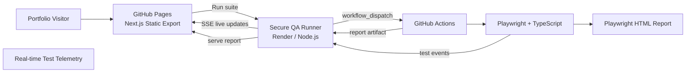

# Phillip Val Cabalo — QA Engineer Portfolio

A QA-first portfolio showcasing **test automation, functional testing, API validation, data verification, CI execution, and real-time Playwright reporting**.

The portfolio is designed to do more than describe testing experience: visitors can trigger a public Playwright regression suite, watch test results update live, and open the resulting Playwright HTML report.

**Live portfolio:** https://phillipqa.github.io/phillipqaportfolio/  
**Playwright repository:** https://github.com/PhillipQA/playwright-automation-project

---

## Portfolio Focus

This project presents my work primarily as a **QA Engineer / Test Automation Engineer**, with Business Analysis experience as an additional strength.

### QA & Test Automation
- Playwright + TypeScript automation
- Page Object Model and reusable fixtures
- Functional, exploratory, regression, and UAT testing
- Cross-browser coverage: Chromium, Firefox, and WebKit
- API validation
- SQL / data validation
- GitHub Actions CI
- Test evidence, traces, screenshots, and HTML reports

### Business Analysis — Supporting Experience
- Requirements gathering and clarification
- BRD / FSD documentation
- Acceptance criteria
- Requirements traceability
- UAT coordination
- Workflow and integration analysis

---

## Key Feature — Live QA Test Lab

The **Live QA Test Lab** connects this static portfolio to a real Playwright CI workflow.

Visitors can:

1. Start the predefined public regression suite.
2. Watch individual Playwright tests update in real time.
3. See pass, fail, running, and browser-suite progress.
4. Follow a compact CLI-style execution console.
5. Open the GitHub Actions run.
6. Inspect the generated Playwright HTML report after completion.

The browser never receives GitHub credentials.

---

## Architecture



### Why the Render runner exists

The portfolio is deployed as a static GitHub Pages site using Next.js `output: 'export'`.

A static browser application cannot safely store a GitHub Personal Access Token. The Render runner acts as the secure server-side bridge:

- GitHub credentials remain server-side.
- Only the predefined regression workflow can be triggered.
- Per-IP and global cooldowns limit repeated public runs.
- CORS restricts requests to approved portfolio origins.
- Real-time telemetry uses a separate shared telemetry token.
- Playwright report artifacts are retrieved and served through the runner.

---

## Real-Time Test Workflow

```text
Visitor clicks "Run Test Suite"
          │
          ▼
Portfolio sends POST /api/qa/run
          │
          ▼
Render QA Runner
          │
          ├── validates origin
          ├── applies cooldown
          └── triggers GitHub workflow_dispatch
          │
          ▼
GitHub Actions starts Playwright
          │
          ▼
Custom Playwright reporter
          │
          ├── emits testBegin
          ├── emits testEnd
          ├── reports pass / fail / retry / duration
          └── sends telemetry to Render
          │
          ▼
Render broadcasts Server-Sent Events (SSE)
          │
          ▼
Portfolio updates the QA dashboard live
          │
          ▼
GitHub uploads playwright-report artifact
          │
          ▼
Portfolio exposes the final HTML report
```

The dashboard also keeps a polling fallback so temporary SSE interruptions do not break the experience.

---

## Featured Work

### Playwright Automation Framework

Public Playwright + TypeScript project demonstrating:

- Authentication setup and reusable storage state
- Positive and negative login scenarios
- Data-driven tests
- Product sorting
- Add-to-cart workflows
- Checkout and order completion
- Chromium, Firefox, and WebKit projects
- API tests
- CI retries and traces
- HTML reporting
- Portfolio telemetry reporter

Repository:  
https://github.com/PhillipQA/playwright-automation-project

### QA Engineering Case Study

Portfolio artifacts include examples of:

- Test planning
- Test case design
- Reproducible defect reporting
- Regression validation
- UAT support
- API validation
- SQL / data verification

### BA Client Ops Tracker

A supporting BA + QA project covering operational workflows such as:

- Clients and projects
- Tasks and subtasks
- Requirements Traceability Matrix
- Communications workflows
- BRD / FSD / DRF document processes
- Sign-off workflows
- Reporting and QA coordination

### AI Document & Requirements Automation

A case study around:

- Document parsing
- OCR-assisted extraction
- BRD-to-FSD mapping
- Supporting-document interpretation
- Scope controls
- Validation and reset workflows
- Requirements traceability

---

## Technology Stack

### Portfolio

| Area | Technology |
|---|---|
| Framework | Next.js 16 |
| UI | React 19 |
| Language | TypeScript |
| Styling | Tailwind CSS |
| Icons | Lucide React |
| Hosting | GitHub Pages |
| Deployment | GitHub Actions |
| Analytics | Vercel Analytics |

### Live QA Runner

| Area | Technology |
|---|---|
| Runtime | Node.js |
| Hosting | Render |
| GitHub integration | GitHub REST API |
| Live updates | Server-Sent Events |
| Report handling | GitHub Actions artifacts + `adm-zip` |

### Test Automation

| Area | Technology |
|---|---|
| Framework | Playwright |
| Language | TypeScript |
| Browsers | Chromium, Firefox, WebKit |
| CI | GitHub Actions |
| Reporting | Playwright HTML Reporter |
| Live telemetry | Custom Playwright Reporter |

---

## Repository Structure

```text
phillipqaportfolio/
├── .github/
│   └── workflows/
│       └── deploy.yml
│
├── app/
│   ├── globals.css
│   ├── icon.png
│   ├── apple-icon.png
│   ├── layout.tsx
│   └── page.tsx
│
├── components/
│   ├── artifacts.tsx
│   ├── contact.tsx
│   ├── experience.tsx
│   ├── expertise.tsx
│   ├── hero.tsx
│   ├── projects.tsx
│   ├── site-header.tsx
│   ├── site-footer.tsx
│   └── test-lab.tsx
│
├── integrations/
│   └── playwright-runner/
│       ├── .env.example
│       ├── package.json
│       └── server.mjs
│
├── lib/
├── public/
├── next.config.mjs
├── package.json
├── pnpm-lock.yaml
└── README.md
```

---

## Local Development

### Requirements

- Node.js 20+
- pnpm 12+

### Install

```bash
pnpm install
```

### Start development server

```bash
pnpm dev
```

Open:

```text
http://localhost:3000
```

### Production build

```bash
pnpm build
```

The Next.js configuration uses:

```text
output: 'export'
```

so the production site is generated into:

```text
out/
```

---

## Configuration

### Portfolio Repository Variable

GitHub:

**Settings → Secrets and variables → Actions → Variables**

| Variable | Purpose |
|---|---|
| `NEXT_PUBLIC_QA_RUNNER_URL` | Public URL of the Render QA runner |

This is intentionally public. It contains no credential.

---

## Render QA Runner Configuration

Deploy:

```text
integrations/playwright-runner/
```

Recommended service configuration:

```text
Runtime: Node
Build Command: npm install
Start Command: npm start
```

Environment variables:

| Variable | Purpose |
|---|---|
| `DEMO_ENABLED` | Enables or disables public runs |
| `GITHUB_TOKEN` | Fine-grained token used server-side |
| `GITHUB_OWNER` | Playwright repository owner |
| `GITHUB_REPO` | Playwright repository name |
| `GITHUB_WORKFLOW` | Workflow file to dispatch |
| `GITHUB_REF` | Branch used by the workflow |
| `ALLOWED_ORIGINS` | Allowed portfolio origins |
| `IP_COOLDOWN_MS` | Per-IP public-run cooldown |
| `GLOBAL_COOLDOWN_MS` | Global public-run cooldown |
| `TELEMETRY_TOKEN` | Shared secret for Playwright telemetry |

Render supplies `PORT` automatically.

The GitHub token should be limited to:

```text
Repository:
PhillipQA/playwright-automation-project

Repository permission:
Actions — Read and write
Metadata — Read-only
```

Do not expose this token through a `NEXT_PUBLIC_` variable.

---

## Playwright Repository Configuration

The public automation repository contains:

```text
.github/workflows/portfolio-demo.yml
reporters/portfolio-reporter.ts
playwright.config.ts
```

### GitHub Repository Variables

| Variable | Purpose |
|---|---|
| `PORTFOLIO_RUNNER_URL` | Render runner URL used by the telemetry reporter |

### GitHub Repository Secrets

| Secret | Purpose |
|---|---|
| `PORTFOLIO_TELEMETRY_TOKEN` | Must match Render `TELEMETRY_TOKEN` |
| `SAUCE_USERNAME` | Test login username |
| `SAUCE_PASSWORD` | Test login password |

The portfolio workflow supplies the public SauceDemo `BASE_URL` directly during CI.

---

## Deployment Workflow

The portfolio deploys through:

```text
.github/workflows/deploy.yml
```

### Deployment sequence

```text
Push to main
    ↓
GitHub Actions
    ↓
Setup pnpm + Node.js 20
    ↓
pnpm install --frozen-lockfile
    ↓
pnpm build
    ↓
Static output generated in /out
    ↓
GitHub Pages artifact upload
    ↓
Deploy to GitHub Pages
```

`NEXT_PUBLIC_QA_RUNNER_URL` is injected during the GitHub Actions build.

The Next.js configuration automatically applies the repository base path when building on GitHub Actions, allowing the site to work correctly at:

```text
https://phillipqa.github.io/phillipqaportfolio/
```

---

## Security Model

The public test lab is intentionally constrained.

- No GitHub token is shipped to the browser.
- Visitors cannot submit arbitrary shell commands.
- Visitors cannot select arbitrary repository paths.
- Only the predefined Playwright workflow is dispatchable.
- GitHub token permissions are repository-scoped.
- Telemetry uses a separate shared secret.
- CORS restricts browser origins.
- Rate limits reduce repeated CI triggering.
- Playwright reports are read from the specific workflow artifacts.

---

## Development Workflow

```text
Feature / content change
        ↓
Local development
        ↓
pnpm build
        ↓
Git commit
        ↓
Push to main
        ↓
GitHub Actions build
        ↓
GitHub Pages deployment
```

For Live QA Test Lab changes:

```text
Portfolio UI change
        │
        ├── components/test-lab.tsx
        │
Runner / API change
        │
        ├── integrations/playwright-runner/
        │
Playwright telemetry change
        │
        └── playwright-automation-project
```

The three layers are intentionally separated so UI changes, server-side credentials, and Playwright execution remain independent.

---

## Related Links

- **Portfolio:** https://phillipqa.github.io/phillipqaportfolio/
- **GitHub:** https://github.com/PhillipQA
- **Playwright automation:** https://github.com/PhillipQA/playwright-automation-project
- **LinkedIn:** https://www.linkedin.com/in/pcabalo/

---

## About

I am a QA professional with experience across manual testing, functional and regression testing, test automation, API validation, SQL/data verification, and UAT. My Business Analyst experience gives me additional context around requirements, acceptance criteria, stakeholder workflows, and traceability—allowing me to test not only whether a feature works, but whether it solves the intended business requirement.
